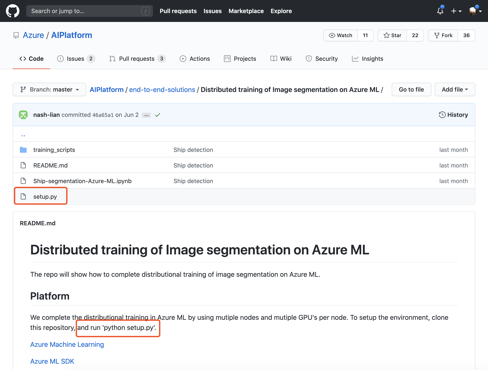
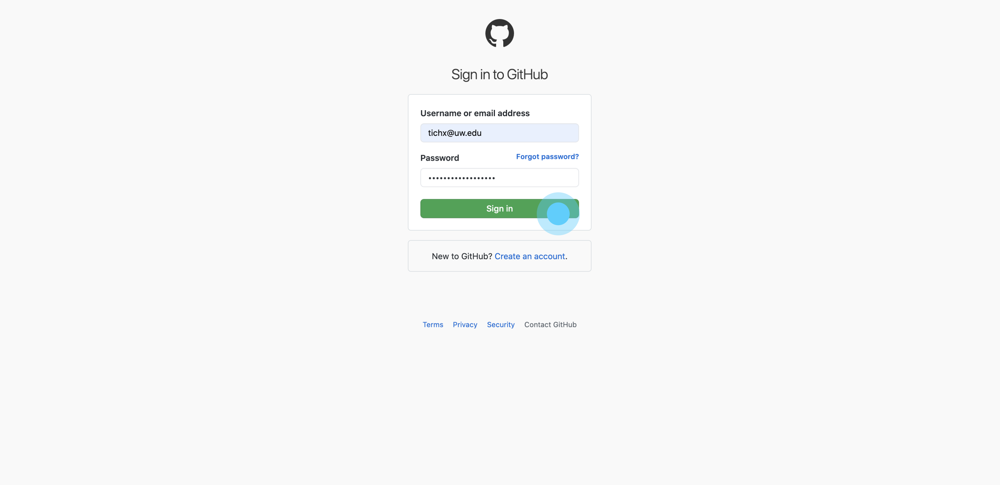
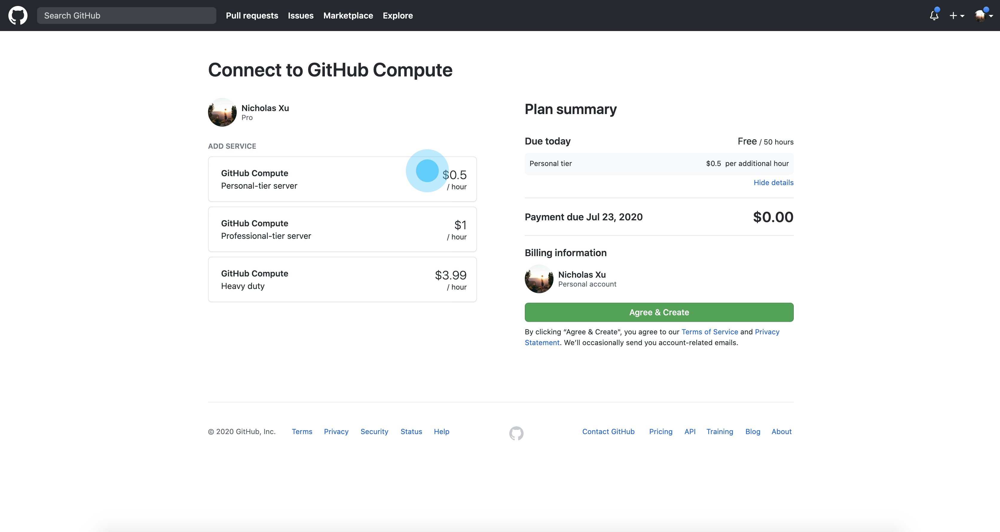
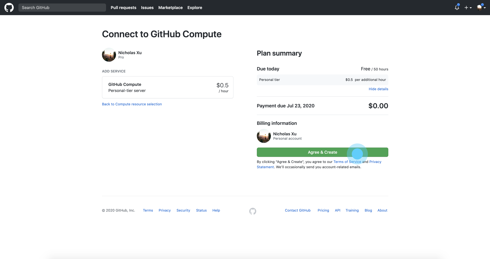
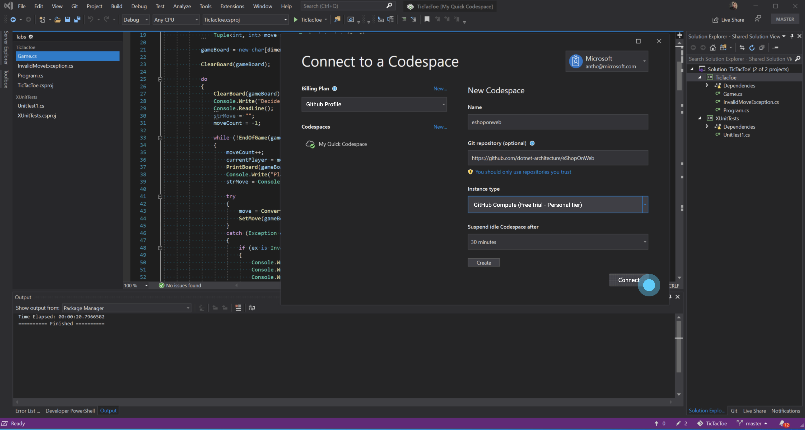

## Senario 1
A data scientist finishes his local experiments and wants to continue working on another new device, or shares his experiments with others.

#### Packaging an environment has never been easier
To accomplish smooth transition from one working machine to another, a data scientist can easily package his current environment or dependencies with ```hub``` command to auto-detect and generate setup files, and then use Git to push to the remote repository.
```bash
# changes to the local machine learning project directory
$ cd dir/to/project/folder

# creates an empty repo, and desinates the repo to be a machine learning type.
$ hub create repo_name -ml

> creating... [\\\\\\\\\\\\\\\\\] 100%
> New ML repository created: git://github.com/YOUR_USER/repo_name.git, done

# scan and generates setup file **
$ hub package-env

Looking for requirements....
Packaging into setup.py.....
    → Success: 'setup.py' generated in /dir/to/current/dir

# lastly, add, commit, and push to GitHub
$ git add .
$ git commit -m "packaged env"
$ git push
```
** During setup compiling, both ```environment.yml``` and ```requirements.txt``` will be generated and packaged into setup.py for simplicity.

EXAMPLE: A simple conda environment file(```environment.yml```):
```yaml
name: end-to-end-solutions
channels: 
    - python
dependencies:
    - python=3.7 # or 2.7
    - numpy=1.9.*
    - pyTorch=2.8
    - tensorflow
    - pip:
        - jtest
```

## Senario 2
A data scientist wants to start working on an existing repo without worrying about environment setup, dependency installations, etc.

#### Re-create a ML repository's environment


The repository owner will use README.md to instruct data scientists to run setup.py file after ```git clone``` .

```bash
$ git clone https://github.com/AIPlatform/end-to-end-solutions.git

> Cloning into `End-to-end solutions`...
> remote: Counting objects: 10, done.
> remote: Compressing objects: 100% (8/8), done.
> remove: Total 10 (delta 1), reused 10 (delta 1)
> Unpacking objects: 100% (10/10), done.

$ cd 'End-to-end solutions'
```
Now, here are a few senarios that data scientists can run into when setting up their local environment.
- **Reuirements met**, auto-setup a new conda envrionment locally
- **Requirements not met**:
    - Move to a Azure compute resource & Codespaces to continue to run the experiment (our value-add)
    - Or, proceed with manual packages installation


With conda:
```bash
$ python setup.py
> locating dependency files...
> checking requirements...
> This repository uses Conda environment, do you want to create a new conda environment? 
> y/n?: y
> Locating enviornment.yml......
> conda nev create -f environment.yml
> Setting up....
> 21 packages installed, done.
$ ~(env-name)$ _
```

With GitHub Compute:
```bash
$ python setup.py
> locating dependency files...
> checking requirements...
> ! ERROR: your machine does not meet the requirements for running (Insufficient CPU: x86 2cores)
> Do you want to setup with GitHub Compute & Codespaces instead? y/n?:y

> Waiting for authentication...
```
Then the user will be prompted to log in at GitHub



Choose an appropriate compute resource. (Ideally, we would recommend a option based on his project, the screen here is only for demo. The pricing details will be considered on another occasion.)



After an option is selected, the user would then choose 'agree & create' to proceed.



Then the user will be either directed to open a Codespace tab online, or be asked to open Visual Studio on his machine. By clicking 'Connect' he will be able to edit the code and run experiment on the GitHub Compute.



```bash
> Authenticating...
> GitHub logged in...taking to GitHub Compute
> Opening up Visual Studio Codespaces...
> Opening browser....
> Or alternatively, you can open link: https://codespaces.com/editor/tichx/12323asdf3
```

